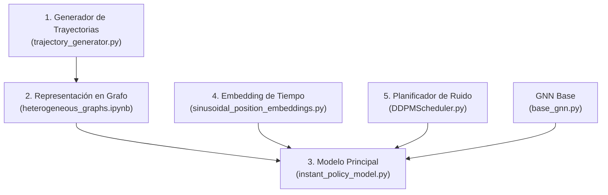
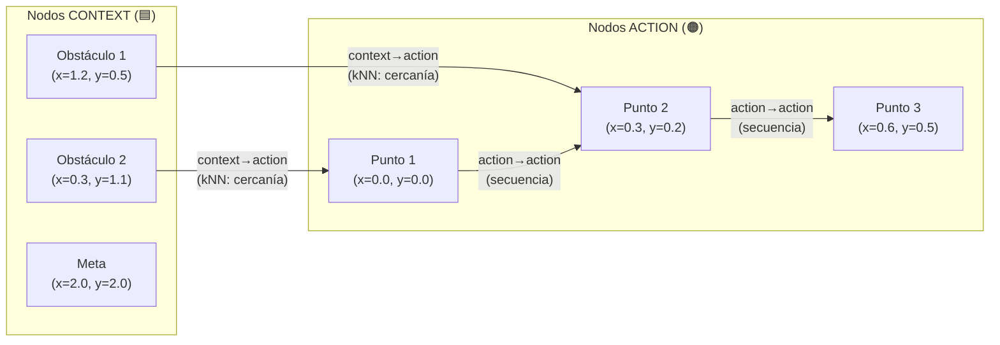
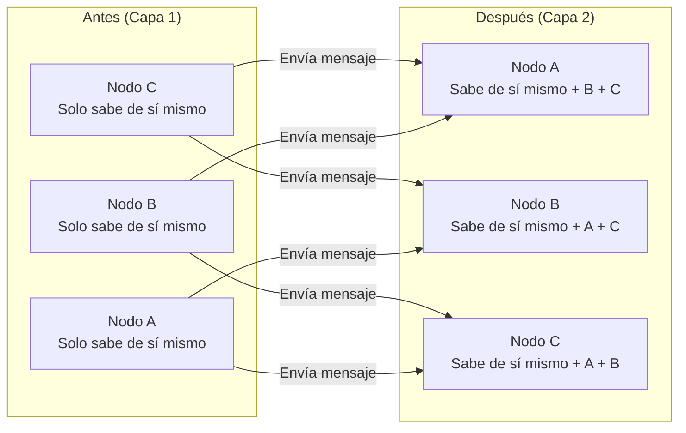
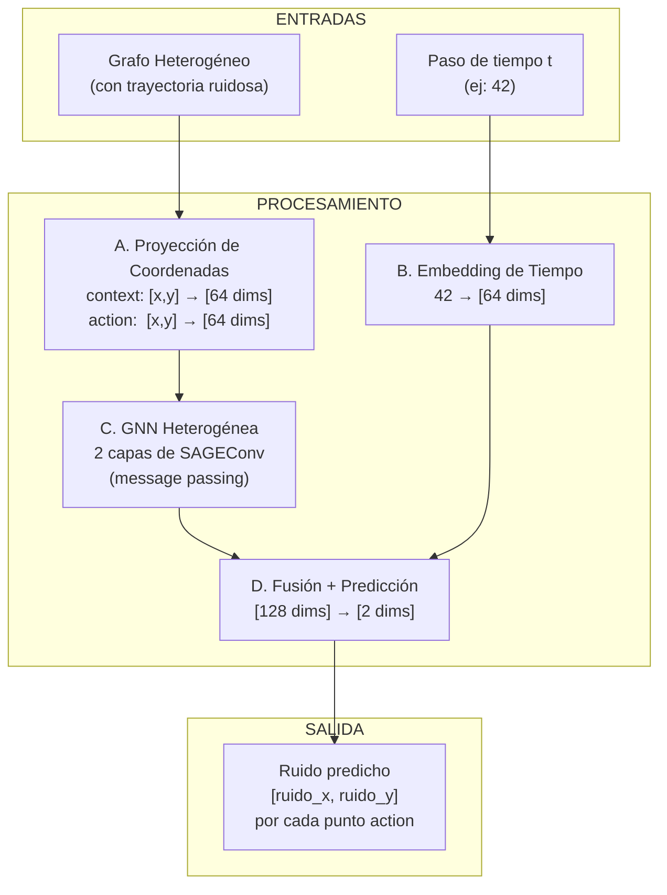
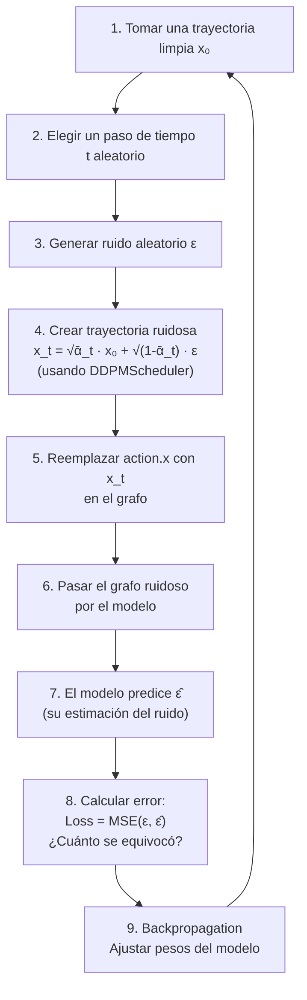
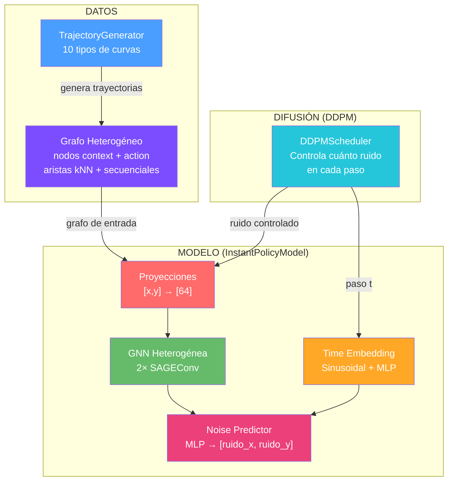

# 🧠 Explicación Detallada del Modelo "Instant Policy"

## ¿Qué hace este modelo en una oración?

> **Este modelo aprende a generar trayectorias (caminos) de movimiento a partir de un contexto (una escena), usando una técnica llamada "difusión" que funciona como limpiar una imagen borrosa paso a paso.**

---

## 📖 La Analogía: El Escultor que Trabaja con Ruido

Imaginá que querés enseñarle a un robot a mover su brazo desde un punto A hasta un punto B, esquivando obstáculos. La técnica que usa este modelo es como enseñarle a un escultor:

1. **Le mostrás esculturas terminadas** (trayectorias limpias de ejemplo)
2. **Las rompés gradualmente** agregándoles polvo/ruido (proceso de difusión "forward")
3. **Le enseñás a restaurarlas** paso a paso desde el polvo (proceso de difusión "reverse")

Una vez entrenado, el escultor puede crear esculturas **nuevas** partiendo de un bloque de mármol amorfo (ruido puro), ¡sin haber visto esa escultura específica antes!

---

## 🧩 Las 5 Piezas del Rompecabezas

Tu proyecto tiene 5 componentes principales. Vamos uno por uno:



---

## 1. 🎯 Generador de Trayectorias — [trajectory_generator.py](file:///c:/CEIA/trabajo-final-ceia/src/classes/trajectory_generator.py)

### ¿Qué es?
Es simplemente una fábrica de caminos 2D (coordenadas x, y). Genera diferentes formas de trayectorias que servirán como **datos de entrenamiento**.

### ¿Qué tipos de trayectorias genera?

| Tipo | Forma | Ejemplo en la vida real |
|------|-------|------------------------|
| `linear` | Línea recta | Un auto en una autopista recta |
| `sinusoidal` | Onda (seno) | Un pez nadando |
| `circular` | Círculo o arco | Un satélite orbitando |
| `parabolic` | Parábola (U) | Una pelota lanzada al aire |
| `exponential` | Curva exponencial | Crecimiento acelerado |
| `sigmoid` | Curva en S | Transición suave entre dos niveles |
| `staggered_step` | Escalones | Subir una escalera |
| `spiral` | Espiral | Un caracol |
| `lemniscate` | Figura de 8 (∞) | Una pista de carreras |
| `lissajous` | Patrones complejos | Figuras de Lissajous en un osciloscopio |

### ¿Cómo funciona internamente?
Cada método toma un número de puntos (`n_points`) y devuelve un array de NumPy de forma `[n_points, 2]` — es decir, una lista de coordenadas (x, y). Por ejemplo, para una línea:

```
Puntos: [(0.0, 0.0), (0.25, 0.0), (0.5, 0.0), (0.75, 0.0), (1.0, 0.0)]
         ↑ inicio                                              ↑ fin
```

> [!NOTE]
> Estas trayectorias son los "ejemplos perfectos" que el modelo usará para aprender. Son el equivalente a las fotos nítidas que luego se van a ensuciar con ruido.

---

## 2. 🔗 Representación en Grafo Heterogéneo

### ¿Qué es un grafo?
Un **grafo** es una estructura de datos con:
- **Nodos** (puntos/bolitas): representan entidades
- **Aristas** (líneas entre bolitas): representan relaciones

Ejemplo cotidiano: una red social donde cada persona es un nodo y cada amistad es una arista.

### ¿Qué es un grafo *heterogéneo*?
Es un grafo donde **hay distintos tipos de nodos y de conexiones**. En tu modelo hay:



| Tipo de Nodo | Qué representa | Features (datos) |
|-------------|----------------|-------------------|
| **context** 🟦 | Puntos del entorno (obstáculos, metas, etc.) | Coordenadas `[x, y]` |
| **action** 🟠 | Puntos de la trayectoria del robot | Coordenadas `[x, y]` |

| Tipo de Arista | Cómo se construye | Para qué sirve |
|---------------|-------------------|----------------|
| `context → action` | **k-Nearest Neighbors** (los k vecinos más cercanos) | Que la trayectoria "vea" los obstáculos cercanos |
| `action → action` | **Secuencial** (punto 1→2, 2→3, etc.) | Que la trayectoria sea suave y continua |

### ¿Por qué un grafo y no una imagen o una tabla?
- Las trayectorias no son imágenes (no son grillas de píxeles)
- Las relaciones espaciales (qué obstáculo está cerca de qué punto) se representan **naturalmente** como conexiones en un grafo
- Los grafos pueden tener **tamaño variable** (distinta cantidad de obstáculos, distinta longitud de trayectoria)

> [!TIP]
> Pensá en el grafo como un mapa de relaciones: "este punto de la trayectoria está cerca de este obstáculo" y "este punto va después de aquel punto".

---

## 3. ⏰ Embedding Sinusoidal del Tiempo — [sinusoidal_position_embeddings.py](file:///c:/CEIA/trabajo-final-ceia/src/classes/sinusoidal_position_embeddings.py)

### ¿Qué problema resuelve?
El proceso de difusión tiene múltiples pasos (por ejemplo, 100). El modelo necesita saber **en qué paso está** para saber cuánto ruido debería haber. Pero un simple número (42, por ejemplo) no le dice mucho a una red neuronal.

### ¿Qué hace?
Convierte un número simple (el paso de tiempo `t`) en un **vector rico** de muchas dimensiones usando funciones seno y coseno con diferentes frecuencias.

### Analogía
Es como representar la hora del día. En vez de decir "son las 14:30", podrías representarla como:
- Posición del sol en el cielo ☀️
- Nivel de luz natural 🌤️
- Nivel de tráfico 🚗
- Actividad en restaurantes 🍽️

Todas estas son "dimensiones" que codifican la misma información (la hora) pero de formas complementarias. El modelo puede aprovechar mejor esta representación rica.

### ¿Cómo funciona paso a paso?

```
Entrada: t = 42 (un número)
                    ↓
   Se generan 32 frecuencias diferentes
   (desde muy lentas hasta muy rápidas)
                    ↓
   Se calcula sin(42 × freq_i) y cos(42 × freq_i)
   para cada frecuencia
                    ↓
   Se concatenan todos los senos y cosenos
                    ↓
Salida: [0.31, -0.95, 0.72, ..., 0.18]  (vector de 64 números)
```

> [!IMPORTANT]
> La propiedad clave es que **pasos cercanos** (como t=41 y t=42) producen vectores **similares**, mientras que pasos lejanos (como t=5 y t=90) producen vectores **muy diferentes**. Esto ayuda al modelo a entender la "progresión" del ruido.

---

## 4. 🌐 Red Neuronal sobre Grafos (GNN) — [base_gnn.py](file:///c:/CEIA/trabajo-final-ceia/src/classes/base_gnn.py)

### ¿Qué es una GNN?
Una **Graph Neural Network** (Red Neuronal sobre Grafos) es una red neuronal diseñada específicamente para trabajar con datos en forma de grafo.

### ¿Cómo funciona? — "Paso de Mensajes" (Message Passing)
El concepto central es increíblemente intuitivo:

> **Cada nodo le pregunta a sus vecinos "¿qué sabés vos?" y combina esa información con la propia.**



### La arquitectura específica: GraphSAGE (SAGEConv)
Tu modelo usa **SAGEConv** (Sample and Aggregate), que funciona así:

1. **Agrega**: Para cada nodo, toma el **promedio** de los features de sus vecinos
2. **Combina**: Concatena ese promedio con los features propios del nodo
3. **Transforma**: Multiplica por una matriz de pesos aprendible (una transformación lineal)

```
Para cada nodo v:
   vecinos = promedio(features de todos los nodos conectados a v)
   nuevo_feature_v = W × [feature_v ; vecinos]
                          └── concatenación ──┘
```

### ¿Por qué 2 capas?
Con **1 capa**, cada nodo solo "ve" a sus vecinos directos.
Con **2 capas**, cada nodo "ve" a sus vecinos **y a los vecinos de sus vecinos** (a 2 saltos de distancia).

```
Con 1 capa:  A conoce a → B, C
Con 2 capas: A conoce a → B, C, y todo lo que B y C conocen
```

Esto permite que un punto de la trayectoria (nodo action) "sepa" no solo de los obstáculos cercanos directos, sino también de otros puntos de la trayectoria que están conectados a esos obstáculos.

### Conversión a Heterogénea: `to_hetero()`
La GNN base es "homogénea" (asume un solo tipo de nodo). La función `to_hetero()` la **clona automáticamente** para cada tipo de arista:

- Una copia de SAGEConv para aristas `context → action`
- Otra copia de SAGEConv para aristas `action → action`

Cada copia aprende pesos **independientes**, lo que permite al modelo tratar diferente la información que viene de un obstáculo vs. la que viene de un punto vecino de la trayectoria.

### Activación GELU
Entre las dos capas hay una función de activación **GELU** (Gaussian Error Linear Unit). Es como un filtro que decide qué información pasa y cuál se atenúa. Funciona similar a ReLU (si el valor es negativo → casi cero, si es positivo → pasa) pero con una transición **suave** en vez de un corte abrupto.

---

## 5. 📊 Planificador de Ruido (DDPM Scheduler) — [DDPMScheduler.py](file:///c:/CEIA/trabajo-final-ceia/src/classes/DDPMScheduler.py)

### ¿Qué es DDPM?
**DDPM** = Denoising Diffusion Probabilistic Model (Modelo Probabilístico de Difusión con Eliminación de Ruido). Es la técnica de difusión que usa tu modelo.

### ¿Qué hace el Scheduler?
Controla **cuánto ruido** se agrega en cada paso del proceso. Pensalo como una perilla de volumen que va del 0% al 100%:

```
Paso t=0:   Trayectoria limpia        🟢 (0% ruido)
Paso t=25:  Un poco borrosa            🟡 (25% ruido)
Paso t=50:  Bastante ruidosa           🟠 (50% ruido)
Paso t=75:  Muy distorsionada          🔴 (75% ruido)
Paso t=99:  Puro ruido aleatorio       ⚫ (100% ruido)
```

### Los parámetros clave

| Variable | Qué es | Analogía |
|----------|--------|----------|
| `betas` | Cuánto ruido se agrega en **cada paso individual** | El volumen que sube en cada giro de la perilla |
| `alphas` | `1 - beta`, cuánta señal original se **preserva** en cada paso | Lo que queda de la canción original |
| `alphas_cumprod` | Producto acumulado de los alphas | El efecto **total acumulado** después de t pasos |

### La fórmula mágica: `add_noise()`

```
x_t = √(ᾱ_t) × x_0  +  √(1 - ᾱ_t) × ε
       ────────────      ──────────────
       "cuánto queda     "cuánto ruido
        de lo original"    se agrega"
```

Donde:
- `x_0` = trayectoria original (limpia)
- `ε` = ruido aleatorio puro (Gaussiano)
- `ᾱ_t` = `alphas_cumprod[t]` (número entre 0 y 1)
- `x_t` = trayectoria con ruido en el paso t

> [!TIP]
> Lo elegante es que esta fórmula permite **saltar directamente** al paso t sin tener que pasar por todos los pasos anteriores. Querés ver cómo se ve la trayectoria en el paso 50? Aplicás la fórmula directamente con `ᾱ_50`, sin calcular los pasos 1 a 49.

---

## 6. 🏗️ El Modelo Principal — [instant_policy_model.py](file:///c:/CEIA/trabajo-final-ceia/src/classes/instant_policy_model.py)

### Vista panorámica

Este es el cerebro del sistema. Recibe un grafo ruidoso y un paso de tiempo, y **predice el ruido** que fue agregado.



### Los 4 Submódulos (detallados)

#### A. Proyecciones de Coordenadas (Embeddings de Nodos)
```python
self.action_emb = nn.Linear(2, 64)   # Para nodos de trayectoria
self.context_emb = nn.Linear(2, 64)  # Para nodos de obstáculos
```

**¿Qué hace?** Toma las coordenadas `[x, y]` (2 números) y las transforma en un vector de 64 números. Es como traducir del "idioma de coordenadas" al "idioma interno del modelo".

**¿Por qué dos proyecciones separadas?** Porque un punto de la trayectoria y un obstáculo son cosas **conceptualmente diferentes** aunque ambos tengan coordenadas (x, y). Al tener pesos separados, el modelo puede aprender representaciones distintas para cada tipo.

#### B. MLP de Tiempo
```python
self.time_mlp = nn.Sequential(
    SinusoidalPositionEmbeddings(64),  # 1 número → 64 números
    nn.Linear(64, 128),                 # 64 → 128
    nn.GELU(),                          # Activación no-lineal
    nn.Linear(128, 64)                  # 128 → 64
)
```

**¿Qué hace?** Transforma el paso de tiempo en un vector rico con una arquitectura de "cuello de botella" (64 → 128 → 64). Primero expande para capturar más información, luego comprime para quedarse con lo esencial.

#### C. GNN Heterogénea
```python
base_gnn = BaseGNN(64)
self.gnn = to_hetero(base_gnn, metadata=metadata, aggr='sum')
```

**¿Qué hace?** Procesa el grafo completo. Cada nodo "habla" con sus vecinos y actualiza su representación. Después de 2 capas, cada punto de la trayectoria sabe:
- De los obstáculos cercanos (vía aristas `context → action`)
- De los puntos vecinos en la trayectoria (vía aristas `action → action`)

#### D. Predictor de Ruido
```python
self.noise_predictor = nn.Sequential(
    nn.Linear(128, 64),  # 128 → 64
    nn.GELU(),
    nn.Linear(64, 2)     # 64 → 2  (predice ruido_x, ruido_y)
)
```

**¿Qué hace?** Toma la concatenación de:
- Lo que la GNN aprendió sobre esa posición en el grafo (64 dims)
- La información del paso de tiempo (64 dims)

Total: 128 dimensiones → las comprime hasta obtener **2 números**: el ruido predicho en x y en y.

### El Flujo Forward (paso a paso)

```mermaid
sequenceDiagram
    participant Input as Entrada
    participant Proj as Proyección
    participant GNN as GNN Heterogénea
    participant Time as Embedding Tiempo
    participant Fusion as Fusión
    participant Output as Salida

    Input->>Proj: Coordenadas [x,y] de cada nodo
    Note over Proj: context: [x,y] → [64 dims]<br/>action: [x,y] → [64 dims]
    Proj->>GNN: Nodos proyectados + aristas del grafo
    Note over GNN: 2 rondas de message passing<br/>Cada nodo absorbe info de vecinos
    GNN->>Fusion: Features actualizados de nodos action [64 dims]
    Input->>Time: Paso t (ej: 42)
    Note over Time: 42 → embedding sinusoidal → MLP
    Time->>Fusion: Embedding de tiempo [64 dims]
    Note over Fusion: Concatena [GNN output ; tiempo] = [128 dims]
    Fusion->>Output: Ruido predicho [ruido_x, ruido_y]
```

---

## 7. 🔄 ¿Cómo se Entrena? (El Ciclo Completo)

Aunque el bucle de entrenamiento no está completamente implementado en tu código aún, así es como funcionaría:



### ¿Por qué predecir el RUIDO y no la trayectoria limpia?
Es una decisión de diseño (llamada **ε-parametrization**) del paper original DDPM. Resulta que predecir el ruido:
- **Estabiliza** el entrenamiento
- Produce **mejores resultados** empíricamente
- Permite una pérdida (loss) más simple: solo comparar el ruido real con el predicho usando MSE (Error Cuadrático Medio)

---

## 8. 🎨 ¿Cómo se Genera una Trayectoria Nueva? (Inferencia)

Una vez entrenado, para generar una trayectoria nueva:

```
Paso 1:  Empezás con RUIDO PURO (coordenadas aleatorias)   ⚫
Paso 2:  El modelo dice "este ruido es lo que sobra"
Paso 3:  Restás un poco de ese ruido                        🔴
Paso 4:  Repetís, el modelo limpia otro poco                🟠
  ...                                                       🟡
Paso 99: Casi limpio                                        🟢
Paso 100: ¡Trayectoria limpia generada!                     ✅
```

Es como un escultor que va sacando material poco a poco hasta revelar la forma escondida dentro del bloque.

---

## 📐 Resumen de Dimensiones

Para que quede claro cómo fluyen los datos (asumiendo `hidden_dim=64` y 20 puntos de trayectoria):

| Paso | Tensor | Forma | Significado |
|------|--------|-------|-------------|
| Entrada context | `context.x` | `[N_ctx, 2]` | N obstáculos, cada uno con (x, y) |
| Entrada action | `action.x` | `[20, 2]` | 20 puntos de trayectoria ruidosa |
| Después de proyección | `x_dict['action']` | `[20, 64]` | 20 puntos en espacio latente |
| Después de GNN | `action_features` | `[20, 64]` | 20 puntos enriquecidos por vecinos |
| Embedding de tiempo | `t_emb` | `[20, 64]` | Tiempo expandido a cada punto |
| Fusión | `fused_features` | `[20, 128]` | Concatenación GNN + tiempo |
| **Salida** | `predicted_noise` | `[20, 2]` | Ruido predicho (Δx, Δy) por punto |

---

## 🗺️ Mapa Conceptual Completo



---

## 🔑 Conceptos Clave Resumidos

| Concepto | ¿Qué es? | Analogía simple |
|----------|----------|-----------------|
| **Difusión** | Agregar ruido gradualmente y aprender a quitarlo | Ensuciar y limpiar una foto |
| **GNN** | Red neuronal que trabaja con grafos | WhatsApp grupal entre nodos vecinos |
| **Message Passing** | Cada nodo recoge info de sus vecinos | Preguntar "¿qué sabés?" a tus amigos |
| **Grafo Heterogéneo** | Grafo con distintos tipos de nodos/aristas | Red social con "personas" y "empresas" |
| **Embedding** | Convertir datos crudos a vectores ricos | Traducir a un idioma que la red entiende |
| **DDPM Scheduler** | Controla el nivel de ruido por paso | Perilla de volumen del ruido |
| **SAGEConv** | Tipo específico de capa GNN | Promedia lo que dicen los vecinos |
| **ε-parametrization** | Predecir el ruido en vez de la señal limpia | Predecir la suciedad en vez de la foto limpia |

> [!NOTE]
> Este modelo es un **proof of concept** (prueba de concepto) para la generación de trayectorias 2D. La arquitectura es la misma que se usaría para un robot real, pero con datos simplificados para facilitar el desarrollo y la comprensión.
