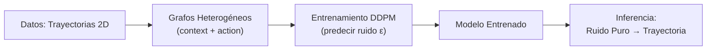

# Recorrido Didáctico Completo: Instant Policy con Grafos Heterogéneos y Difusión

Este documento explica, paso a paso y de forma comprensiva, todo lo que ocurre en el notebook `heterogeneous_graphs.ipynb` **desde la celda de Training hasta el final**, incluyendo un análisis detallado de cada clase auxiliar definida en `src/classes/`.

El objetivo es desmitificar tres bloques conceptuales clave:
1. **Grafos Heterogéneos** y cómo representan la escena.
2. **Redes Neuronales sobre Grafos (GNN)** y cómo procesan esa representación.
3. **Modelos de Difusión (DDPM)** y cómo generan trayectorias a partir de ruido puro.

---

## Tabla de Contenidos

1. [Conceptos Previos](#1-conceptos-previos)
2. [Las Clases Auxiliares (`src/classes/`)](#2-las-clases-auxiliares)
   - 2.1 [TrajectoryGenerator](#21-trajectorygenerator)
   - 2.2 [SinusoidalPositionEmbeddings](#22-sinusoidalpositionembeddings)
   - 2.3 [BaseGNN](#23-basegnn)
   - 2.4 [DDPMScheduler](#24-ddpmscheduler)
   - 2.5 [InstantPolicyModel](#25-instantpolicymodel)
3. [El Bucle de Entrenamiento](#3-el-bucle-de-entrenamiento)
4. [La Ejecución del Entrenamiento](#4-la-ejecución-del-entrenamiento)
5. [La Inferencia (Generación de Trayectorias)](#5-la-inferencia)
6. [La Visualización Final](#6-la-visualización-final)
7. [Resumen y Próximos Pasos](#7-resumen-y-próximos-pasos)

---

## 1. Conceptos Previos

### ¿Qué es un Grafo Heterogéneo?
Un grafo es una estructura de datos formada por **nodos** (puntos) y **aristas** (conexiones entre puntos). Un grafo es **heterogéneo** cuando existen **distintos tipos** de nodos y/o aristas. En este proyecto, el grafo tiene:
- **Nodos `context`**: representan puntos de referencia de la escena (por ejemplo, un punto de inicio y un punto de destino).
- **Nodos `action`**: representan los puntos de la trayectoria que el robot debe seguir.
- **Aristas de distintos tipos**: conectan nodos de contexto con nodos de acción (`context → action`) y nodos de acción entre sí (`action → action`), permitiendo que la información fluya entre ellos.

### ¿Qué es una Red Neuronal sobre Grafos (GNN)?
Es una red neuronal que, en lugar de operar sobre imágenes o texto, opera sobre **grafos**. El mecanismo clave se llama **message passing** (paso de mensajes): cada nodo "recibe" información de sus vecinos a través de las aristas, la agrega, y actualiza su propia representación. Esto permite que cada nodo "entienda" su contexto local dentro del grafo.

### ¿Qué es un Modelo de Difusión (DDPM)?
Es un modelo generativo inspirado en la termodinámica. Funciona en dos fases:
1.  **Proceso Directo (Forward)**: se toma un dato limpio (una trayectoria) y se le **añade ruido gaussiano** gradualmente a lo largo de `T` pasos, hasta convertirlo en ruido puro.
2.  **Proceso Inverso (Reverse)**: una red neuronal aprende a **deshacer** ese proceso de ruido, paso a paso, desde `T` hasta `0`. Una vez entrenada, se le puede dar ruido puro y pedirle que genere una trayectoria limpia.

La clave del entrenamiento es que el modelo **no predice la trayectoria directamente**, sino que predice **el ruido (ε)** que fue añadido en un paso dado. Esto se conoce como **parametrización ε**.

---

## 2. Las Clases Auxiliares

Todas las clases están en la carpeta [src/classes/](file:///c:/CEIA/trabajo-final-ceia/src/classes/).

### 2.1 TrajectoryGenerator

**Archivo**: [trajectory_generator.py](file:///c:/CEIA/trabajo-final-ceia/src/classes/trajectory_generator.py)

**Propósito**: Generar datos de entrenamiento. Cada método estático produce una trayectoria 2D diferente (lineal, sinusoidal, circular, etc.) como un array NumPy de forma `(n_points, 2)`.

```python
class TrajectoryGenerator:
    @staticmethod
    def linear(n_points=50, noise_std=0.0):
        t = np.linspace(0, 1, n_points)       # 'n_points' valores equiespaciados entre 0 y 1
        x = t                                   # Coordenada X: avanza linealmente
        y = t                                   # Coordenada Y: avanza linealmente (diagonal)
        # Se apila en una matriz (n_points, 2) y se añade ruido gaussiano
        trajectory = np.stack([x, y], axis=-1) + np.random.randn(n_points, 2) * noise_std
        return trajectory.astype(np.float32)
```

**Línea por línea**:
- `np.linspace(0, 1, n_points)`: crea un vector de `n_points` valores uniformemente distribuidos entre 0 y 1. Este vector `t` actúa como el "tiempo" o parámetro de la curva.
- `x = t` / `y = t`: define la forma de la trayectoria. En el caso lineal, `x` e `y` avanzan igual, produciendo una línea diagonal.
- `np.stack([x, y], axis=-1)`: combina los vectores `x` e `y` en una matriz de `(n_points, 2)`, donde cada fila es un punto `(x, y)`.
- `+ np.random.randn(...) * noise_std`: opcionalmente añade ruido gaussiano a cada coordenada, haciendo la trayectoria más realista.
- `.astype(np.float32)`: convierte a flotante de 32 bits, el formato estándar para redes neuronales.

Los demás métodos (`sinusoidal`, `circular`, `spiral`, etc.) siguen la misma estructura, cambiando solo las fórmulas de `x` e `y`.

> [!NOTE]
> Estas trayectorias son el "ground truth" (la verdad de referencia) sobre la que el modelo de difusión aprenderá a generar trayectorias nuevas.

---

### 2.2 SinusoidalPositionEmbeddings

**Archivo**: [sinusoidal_position_embeddings.py](file:///c:/CEIA/trabajo-final-ceia/src/classes/sinusoidal_position_embeddings.py)

**Propósito**: Codificar el **timestep** `t` del proceso de difusión como un vector de alta dimensión. Esto es necesario porque el modelo necesita saber "en qué paso del proceso de ruido estamos" para predecir correctamente cuánto ruido quitar.

```python
class SinusoidalPositionEmbeddings(nn.Module):
    def __init__(self, dim):
        super().__init__()
        self.dim = dim  # Dimensión del vector de salida (ej: 64)

    def forward(self, time):
        device = time.device
        half_dim = self.dim // 2  # Usamos mitad senos, mitad cosenos
        # Fórmula: log(10000) / (half_dim - 1)
        embeddings = math.log(10000) / (half_dim - 1)
        # Crea una progresión geométrica de frecuencias
        embeddings = torch.exp(torch.arange(half_dim, device=device) * -embeddings)
        # Multiplica el timestep por cada frecuencia: (batch, 1) x (1, half_dim)
        embeddings = time[:, None] * embeddings[None, :]
        # Concatena sin y cos para obtener el vector final
        embeddings = torch.cat((embeddings.sin(), embeddings.cos()), dim=-1)
        return embeddings
```

**¿Por qué funciona?**
Un número entero como `t = 42` no le dice mucho a una red neuronal. Pero si lo transformamos en un vector de, digamos, 64 componentes usando funciones seno y coseno de diferentes frecuencias, creamos una "huella dactilar" única para cada `t`. Las frecuencias bajas capturan cambios lentos y las altas capturan cambios rápidos, dando al modelo una señal rica sobre la posición temporal.

> [!TIP]
> Esta técnica viene directamente de los **Transformers** (el paper "Attention is All You Need"), donde se usa para codificar la posición de cada palabra en una secuencia.

---

### 2.3 BaseGNN

**Archivo**: [base_gnn.py](file:///c:/CEIA/trabajo-final-ceia/src/classes/base_gnn.py)

**Propósito**: Definir la arquitectura base de la Red Neuronal sobre Grafos. Esta red se definirá inicialmente para un grafo **homogéneo** (un solo tipo de nodo/arista) y luego se convertirá automáticamente a **heterogénea** mediante `to_hetero`.

```python
class BaseGNN(torch.nn.Module):
    def __init__(self, in_channels, hidden_channels, out_channels):
        super().__init__()
        # Capa 1: SAGEConv lazy (infiere in_channels automáticamente)
        self.conv1 = SAGEConv((-1, -1), hidden_channels)
        # Capa 2: SAGEConv
        self.conv2 = SAGEConv((-1, -1), out_channels)

    def forward(self, x, edge_index):
        # Paso 1: Aplicar primera convolución de grafos
        x = self.conv1(x, edge_index)
        # Paso 2: Activación no lineal GELU
        x = F.gelu(x)
        # Paso 3: Aplicar segunda convolución de grafos
        x = self.conv2(x, edge_index)
        return x
```

**Línea por línea**:
- `SAGEConv((-1, -1), hidden_channels)`: Una capa de convolución **GraphSAGE**. El `(-1, -1)` indica "inicialización lazy": PyTorch Geometric inferirá automáticamente las dimensiones de entrada la primera vez que pasen datos. `hidden_channels` es la dimensión de la capa oculta (ej: 64).
- `self.conv1(x, edge_index)`: ejecuta el **message passing**. Cada nodo recoge (agrega) información de sus vecinos según `edge_index` (la lista de aristas) y la combina con su propia información `x` para producir una nueva representación.
- `F.gelu(x)`: función de activación **GELU** (Gaussian Error Linear Unit). Es una función no lineal suave, popular en modelos modernos, que introduce la capacidad de aprender patrones complejos.
- `self.conv2(...)`: una segunda ronda de message passing que refina aún más las representaciones.

> [!IMPORTANT]
> La magia de `to_hetero` (usada en `InstantPolicyModel`) convierte esta GNN simple en una que maneja automáticamente los distintos tipos de nodo (`context`, `action`) y arista, creando parámetros separados para cada tipo de relación.

---

### 2.4 DDPMScheduler

**Archivo**: [DDPMScheduler.py](file:///c:/CEIA/trabajo-final-ceia/src/classes/DDPMScheduler.py)

**Propósito**: Encapsular toda la **matemática del proceso de difusión** (tanto directo como inverso). Precalcula todas las constantes necesarias.

```python
class DDPMScheduler:
    def __init__(self, num_timesteps=100, beta_start=0.0001, beta_end=0.02):
        self.num_timesteps = num_timesteps
        # Schedule lineal de betas (varianzas del ruido en cada paso)
        self.betas = torch.linspace(beta_start, beta_end, num_timesteps)
        # alpha_t = 1 - beta_t
        self.alphas = 1.0 - self.betas
        # Producto acumulado de alphas: bar{alpha}_t = prod_{i=1}^{t} alpha_i
        self.alphas_cumprod = torch.cumprod(self.alphas, dim=0)
```

**Constantes clave**:
- **`betas`**: un schedule (programa) lineal de `T` valores entre `beta_start` y `beta_end`. Cada `beta_t` indica **cuánto ruido se añade** en el paso `t`. Valores pequeños al inicio (poco ruido), grandes al final (mucho ruido).
- **`alphas`**: `1 - beta_t`. Representan **cuánta señal original se conserva** en cada paso.
- **`alphas_cumprod`** ($\bar{\alpha}_t$): el **producto acumulado** de todos los alphas hasta el paso `t`. Esta es la constante más importante porque permite calcular directamente $x_t$ a partir de $x_0$ sin necesidad de iterar paso a paso.

```python
    def add_noise(self, x_start, noise, timesteps):
        """Proceso Directo: contamina x_0 para obtener x_t."""
        sqrt_alpha_cumprod = torch.sqrt(self.alphas_cumprod[timesteps])
        sqrt_one_minus_alpha_cumprod = torch.sqrt(1.0 - self.alphas_cumprod[timesteps])
        # Ajustar dimensiones para broadcasting
        while len(sqrt_alpha_cumprod.shape) < len(x_start.shape):
            sqrt_alpha_cumprod = sqrt_alpha_cumprod.unsqueeze(-1)
            sqrt_one_minus_alpha_cumprod = sqrt_one_minus_alpha_cumprod.unsqueeze(-1)
        # Fórmula: x_t = sqrt(bar_alpha_t) * x_0 + sqrt(1 - bar_alpha_t) * epsilon
        return sqrt_alpha_cumprod * x_start + sqrt_one_minus_alpha_cumprod * noise
```

**Fórmula del Proceso Directo**:

$$x_t = \sqrt{\bar{\alpha}_t} \cdot x_0 + \sqrt{1 - \bar{\alpha}_t} \cdot \epsilon$$

Donde:
- $x_0$ es la trayectoria limpia original.
- $\epsilon$ es ruido gaussiano puro $\sim \mathcal{N}(0, I)$.
- $x_t$ es la trayectoria contaminada al paso `t`.

La belleza de esta fórmula es que permite saltar **directamente** de $x_0$ a cualquier $x_t$ sin pasar por los pasos intermedios. Esto es crucial para el entrenamiento eficiente.

---

### 2.5 InstantPolicyModel

**Archivo**: [instant_policy_model.py](file:///c:/CEIA/trabajo-final-ceia/src/classes/instant_policy_model.py)

**Propósito**: Esta es la **red neuronal principal**. Integra la GNN con el proceso de difusión. Recibe un grafo heterogéneo (con trayectoria ruidosa) y un timestep `t`, y predice el ruido `ε` que fue añadido.

```python
class InstantPolicyModel(torch.nn.Module):
    def __init__(self, metadata, node_features=2, hidden_dim=64):
        super().__init__()
        # 1. Embeddings temporales: codifica el timestep t
        self.time_embed = SinusoidalPositionEmbeddings(hidden_dim)
        # 2. Proyección de features: expande (x,y) a hidden_dim dimensiones
        self.feature_proj = nn.Linear(node_features, hidden_dim)
        # 3. GNN heterogénea: convierte la BaseGNN homogénea
        base_gnn = BaseGNN(hidden_dim, hidden_dim, hidden_dim)
        self.gnn = to_hetero(base_gnn, metadata)
        # 4. Cabeza de predicción de ruido: reduce hidden_dim a node_features (2)
        self.noise_pred_head = nn.Linear(hidden_dim, node_features)
```

**Línea por línea**:
- `SinusoidalPositionEmbeddings(hidden_dim)`: crea el codificador de timesteps (ver sección 2.2).
- `nn.Linear(node_features, hidden_dim)`: una capa lineal que transforma las coordenadas `(x, y)` (2 dimensiones) en un vector de `hidden_dim` dimensiones (ej: 64). Esto es necesario porque la GNN trabaja en un espacio de mayor dimensión para tener más capacidad expresiva.
- `to_hetero(base_gnn, metadata)`: la función clave de PyTorch Geometric. Toma la `BaseGNN` homogénea y la convierte automáticamente en una GNN heterogénea, duplicando los parámetros para cada tipo de nodo y arista definido en `metadata`.
- `nn.Linear(hidden_dim, node_features)`: la "cabeza" final que reduce la representación de alta dimensión de vuelta a las 2 coordenadas `(x, y)`, generando la **predicción de ruido**.

```python
    def forward(self, hetero_data, timesteps):
        # --- Paso 1: Proyectar features de TODOS los tipos de nodo ---
        x_dict = {}
        for node_type in hetero_data.node_types:
            x_dict[node_type] = self.feature_proj(hetero_data[node_type].x)

        # --- Paso 2: Generar el embedding temporal ---
        t_emb = self.time_embed(timesteps.float())

        # --- Paso 3: Inyectar el timestep en los nodos 'action' ---
        # Mapear timestep por grafo a timestep por nodo
        node_t_emb = t_emb[hetero_data['action'].batch]
        x_dict['action'] = x_dict['action'] + node_t_emb

        # --- Paso 4: Pasar por la GNN heterogénea ---
        edge_index_dict = hetero_data.edge_index_dict
        out_dict = self.gnn(x_dict, edge_index_dict)

        # --- Paso 5: Predecir el ruido solo para nodos 'action' ---
        predicted_noise = self.noise_pred_head(out_dict['action'])
        return predicted_noise
```

**Forward Pass - Flujo completo**:

1.  **Proyección de features** (`feature_proj`): Todas las coordenadas `(x, y)` de nodos `context` y `action` se transforman de 2D a 64D.
2.  **Embedding temporal** (`time_embed`): El timestep `t` se convierte en un vector de 64D.
3.  **Inyección del timestep**: El embedding temporal se **suma** a las features de los nodos `action`. Esto es fundamental: le dice al modelo "estamos en el paso t del proceso de difusión".
    - `hetero_data['action'].batch`: este tensor mapea cada nodo a su grafo dentro del batch. Si el batch tiene 16 grafos con 50 nodos action cada uno, hay 800 nodos; `.batch` es un tensor de 800 elementos que indica a qué grafo (0-15) pertenece cada nodo. Así, cada nodo recibe el timestep de **su** grafo.
4.  **Message Passing** (GNN): La GNN procesa el grafo completo. Los nodos `action` reciben información de los nodos `context` (a través de las aristas `context → action`) y de otros nodos `action` (a través de aristas `action → action`). Esto es lo que le da al modelo la capacidad de generar trayectorias **condicionadas** al contexto.
5.  **Predicción de ruido**: Solo las salidas de los nodos `action` pasan por la cabeza lineal final para producir la predicción de ruido en el espacio original de 2 coordenadas.

> [!IMPORTANT]
> El modelo NO predice la trayectoria directamente. Predice el **ruido ε** que fue añadido a la trayectoria limpia. Esta es la **parametrización ε**, estándar en modelos DDPM.

---

## 3. El Bucle de Entrenamiento

**Función**: `train_diffusion_policy` (definida en el notebook)

Esta función orquesta todo el proceso de entrenamiento. Veamos cada paso:

```python
def train_diffusion_policy(model, dataset_list, epochs=100, batch_size=32, lr=1e-3, device='cpu'):
    # DataLoader específico para grafos de PyG (agrupa grafos en batches)
    dataloader = DataLoader(dataset_list, batch_size=batch_size, shuffle=True)
    # Optimizador AdamW (Adam con weight decay)
    optimizer = AdamW(model.parameters(), lr=lr)
    # Scheduler DDPM con 100 pasos de difusión
    scheduler = DDPMScheduler(num_timesteps=100)
    # Mover modelo al dispositivo (GPU si disponible)
    model = model.to(device)
    model.train()  # Modo entrenamiento
    loss_history = []
```

**Preparación**:
- `DataLoader(dataset_list, batch_size=batch_size, shuffle=True)`: el DataLoader de PyG sabe combinar múltiples grafos en un solo "super-grafo" (batch). Cada batch contiene `batch_size` grafos apilados.
- `AdamW`: un optimizador moderno que ajusta los pesos del modelo. `lr=1e-3` es la tasa de aprendizaje.
- `DDPMScheduler(num_timesteps=100)`: precalcula todas las constantes del schedule de difusión.
- `model.train()`: activa el modo de entrenamiento (habilita dropout, BN, etc.).

```python
    for epoch in range(epochs):
        total_loss = 0
        pbar = tqdm(dataloader, desc=f"Epoch {epoch+1}/{epochs}", leave=False)

        for batch in pbar:
            batch = batch.to(device)
            optimizer.zero_grad()
```

**Por cada batch**:
- `batch.to(device)`: mueve el batch completo a GPU.
- `optimizer.zero_grad()`: resetea los gradientes acumulados del paso anterior.

```python
            # A. Obtener las trayectorias "limpias" (x_0)
            clean_actions = batch['action'].x

            # B. Generar ruido gaussiano puro (epsilon)
            noise = torch.randn_like(clean_actions)

            # C. Seleccionar un timestep aleatorio para cada grafo del batch
            num_graphs = batch.num_graphs
            timesteps = torch.randint(0, scheduler.num_timesteps, (num_graphs,), device=device).long()

            # Mapear timesteps a cada nodo usando el índice de batch
            node_timesteps = timesteps[batch['action'].batch]
```

**El Truco del Entrenamiento DDPM**:
- **A**: Se extraen las coordenadas `(x, y)` de los nodos `action` del batch. Estas son las trayectorias "limpias" $x_0$.
- **B**: Se genera ruido $\epsilon \sim \mathcal{N}(0, I)$ con la misma forma que las trayectorias.
- **C**: Para cada grafo en el batch, se elige un timestep `t` aleatorio entre 0 y 99. Esto es clave: en cada iteración, el modelo ve **distintos niveles de ruido** para distintos ejemplos, lo que le permite aprender a manejar todos los niveles.
- **Mapeo a nodos**: Si el batch tiene 16 grafos y cada grafo tiene 50 nodos action, tenemos 16 timesteps que se mapean a 800 nodos usando `batch['action'].batch`.

```python
            # D. Contaminar las acciones con el ruido
            noisy_actions = scheduler.add_noise(clean_actions, noise, node_timesteps)

            # E. Reemplazar las features con la versión ruidosa
            batch['action'].x = noisy_actions

            # F. Forward Pass: predecir el RUIDO inyectado
            predicted_noise = model(batch, timesteps)

            # G. Calcular la pérdida (MSE)
            loss = F.mse_loss(predicted_noise, noise)

            # H. Backpropagation y Optimización
            loss.backward()
            optimizer.step()
```

- **D**: Aplica la fórmula directa $x_t = \sqrt{\bar{\alpha}_t} \cdot x_0 + \sqrt{1-\bar{\alpha}_t} \cdot \epsilon$ para obtener las trayectorias ruidosas.
- **E**: "Esconde la respuesta": las features originales se reemplazan por las ruidosas. Ahora el modelo solo ve las coordenadas contaminadas.
- **F**: El modelo recibe el grafo (con trayectorias ruidosas) y los timesteps, y devuelve su predicción de cuánto ruido contienen.
- **G**: `mse_loss(predicted_noise, noise)`: calcula el **Error Cuadrático Medio** entre el ruido real (`noise`, que nosotros generamos) y el predicho (`predicted_noise`). El objetivo es minimizar esta diferencia.
- **H**: `loss.backward()` calcula los gradientes y `optimizer.step()` actualiza los pesos del modelo.

> [!TIP]
> La intuición es simple: le decimos al modelo "esta trayectoria tiene **este** ruido añadido en el paso `t`", y le pedimos que adivine **cuánto ruido** se añadió. Con suficientes ejemplos, el modelo aprende a predecir el ruido con precisión, lo que luego le permite "limpiarlo" paso a paso durante la inferencia.

---

## 4. La Ejecución del Entrenamiento

```python
# 1. Cargar datos en una lista
dataset_list = []
for key, graph in iter_dataset_as_graphs(HDF5_PATH):
    dataset_list.append(graph)

# 2. Instanciar el modelo
device = torch.device('cuda' if torch.cuda.is_available() else 'cpu')
model = InstantPolicyModel(
    metadata=dataset_list[0].metadata(),  # Tipos de nodos y aristas
    node_features=2,                       # Coordenadas (x, y)
    hidden_dim=64                          # Dimensión interna
)

# 3. Entrenar
historial = train_diffusion_policy(
    model=model,
    dataset_list=dataset_list,
    epochs=20,
    batch_size=16,
    lr=1e-3,
    device=device
)

# 4. Graficar la curva de aprendizaje
plt.plot(historial)
plt.title("Curva de Aprendizaje - Diffusion Loss")
plt.xlabel("Epoch")
plt.ylabel("MSE Loss")
plt.show()
```

**Puntos clave**:
- `dataset_list[0].metadata()`: extrae la información de estructura del grafo (tipos de nodos: `context`, `action`; tipos de aristas: `context→action`, `action→action`) del primer ejemplo. Esta metadata es necesaria para `to_hetero`.
- `epochs=20`: el modelo ve TODO el dataset 20 veces.
- `batch_size=16`: procesa 16 grafos a la vez.
- La **curva de pérdida** descendente (observable en la salida del notebook: de ~0.50 a ~0.08) confirma que el modelo está aprendiendo a predecir el ruido correctamente.

---

## 5. La Inferencia (Generación de Trayectorias)

### 5.1 El Paso Inverso DDPM (`ddpm_reverse_step`)

Esta función implementa un **único paso de denoising** (limpieza), yendo de $x_t$ a $x_{t-1}$:

```python
def ddpm_reverse_step(scheduler, model, current_x, t, graph, device):
    t_tensor = torch.tensor([t], device=device, dtype=torch.long)

    # Insertar la trayectoria ruidosa actual en el grafo
    graph['action'].x = current_x

    # Pedir a la GNN que prediga el ruido
    with torch.no_grad():
        predicted_noise = model(graph, t_tensor)

    # Extraer constantes del scheduler
    alpha_t = scheduler.alphas[t].to(device)
    alpha_cumprod_t = scheduler.alphas_cumprod[t].to(device)

    # Calcular la parte determinista
    term1 = 1.0 / torch.sqrt(alpha_t)
    term2 = (1.0 - alpha_t) / torch.sqrt(1.0 - alpha_cumprod_t)
    mean_x_t_minus_1 = term1 * (current_x - term2 * predicted_noise)

    # Añadir ruido estocástico (excepto en t=0)
    if t > 0:
        z = torch.randn_like(current_x)
        sigma_t = torch.sqrt(1.0 - alpha_t)
        x_t_minus_1 = mean_x_t_minus_1 + sigma_t * z
    else:
        x_t_minus_1 = mean_x_t_minus_1

    return x_t_minus_1
```

**Fórmula del Proceso Inverso**:

$$x_{t-1} = \frac{1}{\sqrt{\alpha_t}} \left( x_t - \frac{1-\alpha_t}{\sqrt{1-\bar{\alpha}_t}} \cdot \epsilon_\theta(x_t, t) \right) + \sigma_t \cdot z$$

Donde:
- $\epsilon_\theta(x_t, t)$ es el ruido predicho por el modelo.
- $z \sim \mathcal{N}(0, I)$ es ruido fresco (componente estocástico).
- $\sigma_t = \sqrt{1 - \alpha_t}$ es la desviación estándar del ruido inyectado.
- En el paso final ($t = 0$), **no se añade ruido** ($z = 0$): queremos la predicción limpia.

**Intuición**: Estamos "restando" la cantidad de ruido que el modelo cree que hay en $x_t$, y luego añadimos un poco de ruido aleatorio fresco para mantener la diversidad en la generación.

### 5.2 La Generación Completa (`generate_trajectory`)

```python
def generate_trajectory(model, scheduler, context_graph, num_action_nodes=50, device='cpu'):
    model.eval()  # Modo evaluación (desactiva dropout, etc.)

    # 1. Inicio: ruido gaussiano puro (la "trayectoria" inicial)
    current_x = torch.randn((num_action_nodes, 2), device=device)
    trajectory_history = [current_x.cpu().numpy()]

    # 2. Clonar el grafo de contexto
    infer_graph = copy.deepcopy(context_graph).to(device)

    # 3. Proceso inverso: T pasos de denoising
    for t in reversed(range(scheduler.num_timesteps)):
        current_x = ddpm_reverse_step(
            scheduler=scheduler, model=model,
            current_x=current_x, t=t,
            graph=infer_graph, device=device
        )
        if t % 10 == 0 or t == 0:
            trajectory_history.append(current_x.cpu().numpy())

    return current_x.cpu(), trajectory_history
```

**Flujo paso a paso**:
1.  **Inicio con ruido puro**: `torch.randn((50, 2))` genera 50 puntos 2D completamente aleatorios. Esto es $x_T$ — la trayectoria es puro ruido.
2.  **Clonación del grafo**: Se copia el grafo de contexto (que contiene los nodos `context` con la información de la escena) para no modificar el original.
3.  **Iteración inversa**: Se itera desde $t = T-1$ hasta $t = 0$ (99 pasos). En cada paso:
    - Se inserta $x_t$ actual en el grafo.
    - El modelo predice el ruido.
    - Se aplica la fórmula inversa para obtener $x_{t-1}$.
    - Cada 10 pasos se guarda un snapshot para visualización posterior.
4.  **Resultado**: Al final, $x_0$ es la trayectoria generada, **condicionada** por el contexto.

> [!IMPORTANT]
> El grafo de contexto (nodos `context`) se mantiene **fijo** durante toda la inferencia. Solo cambian los nodos `action`. Esto es lo que permite que la trayectoria generada esté **condicionada** a la escena.

---

## 6. La Visualización Final

El notebook concluye con dos visualizaciones:

1.  **Comparación Contexto vs. Trayectoria Generada**: muestra los nodos de contexto (la "escena") y la trayectoria generada, permitiendo verificar visualmente si la trayectoria tiene sentido en relación al contexto.

2.  **Proceso de Denoising**: muestra los snapshots guardados durante la inferencia, visualizando cómo la trayectoria evoluciona desde ruido puro hasta una forma coherente.

---

## 7. Resumen y Próximos Pasos

### Resumen del Pipeline Completo



1.  **Datos**: `TrajectoryGenerator` produce trayectorias de ejemplo.
2.  **Representación**: Cada trayectoria se convierte en un grafo heterogéneo con nodos `context` y `action`.
3.  **Entrenamiento**: El modelo aprende a predecir el ruido $\epsilon$ añadido a las trayectorias, condicionado por:
    - El grafo de contexto (escena).
    - El timestep $t$ (nivel de ruido).
4.  **Generación**: Partiendo de ruido puro, el modelo aplica iterativamente el proceso inverso para producir una trayectoria limpia.

### Próximos Pasos Sugeridos
- **Validación**: Implementar un loop de validación para monitorear sobreajuste.
- **Logging**: Integrar W&B o TensorBoard para curvas de pérdida.
- **Visualización del denoising**: Graficar la trayectoria en varios timesteps intermedios para analizar la convergencia.
- **Optimización**: Evaluar si `copy.deepcopy` del grafo es un cuello de botella para inferencia en tiempo real.
